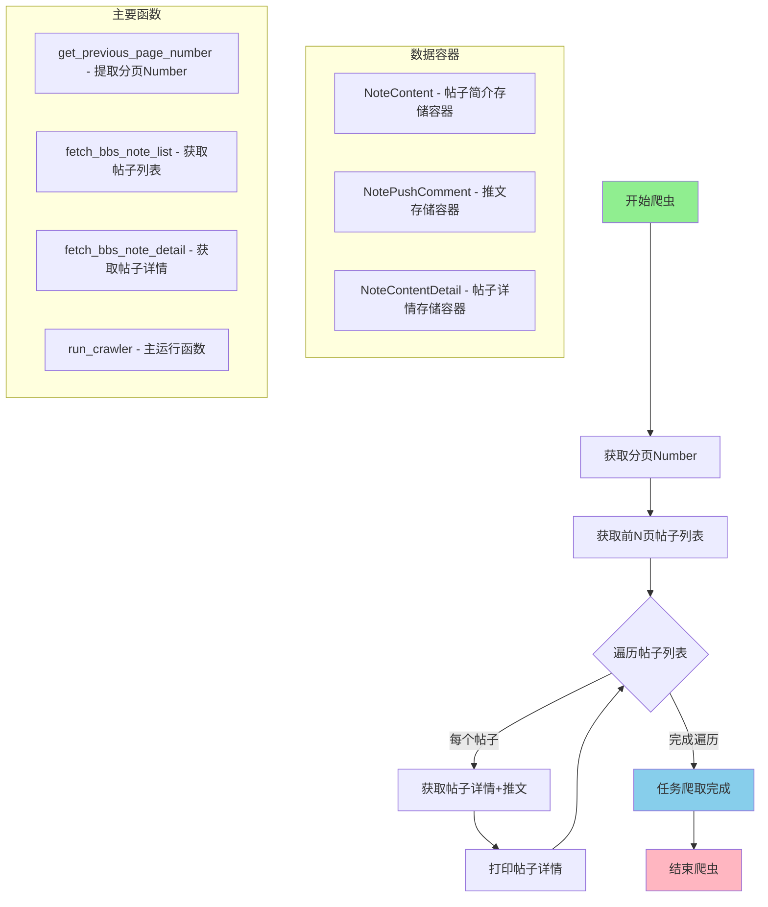

```mermaid
graph TD
    A[开始爬虫] --> B[获取分页Number]
    B --> C[获取前N页帖子列表]
    C --> D{遍历帖子列表}
    D -->|每个帖子| E[获取帖子详情+推文]
    E --> F[打印帖子详情]
    F --> D
    D -->|完成遍历| G[任务爬取完成]
    G --> H[结束爬虫]

    subgraph 数据容器
        I[NoteContent - 帖子简介存储容器]
        J[NotePushComment - 推文存储容器]
        K[NoteContentDetail - 帖子详情存储容器]
    end

    subgraph 主要函数
        L[get_previous_page_number - 提取分页Number]
        M[fetch_bbs_note_list - 获取帖子列表]
        N[fetch_bbs_note_detail - 获取帖子详情]
        O[run_crawler - 主运行函数]
    end

    style A fill:#90EE90
    style H fill:#FFB6C1
    style G fill:#87CEEB
```