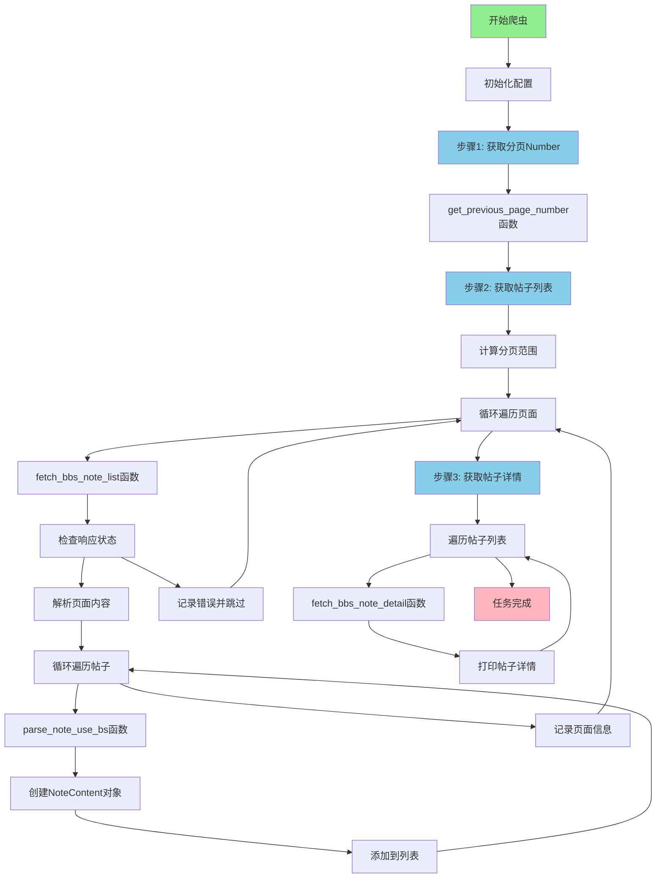

```mermaid
graph TD
    Start["开始爬虫"] --> Config["初始化配置"]
    Config --> Step1["步骤1: 获取分页Number"]
    Step1 --> GetPageNum["get_previous_page_number函数"]
    GetPageNum --> Step2["步骤2: 获取帖子列表"]
    Step2 --> CalcRange["计算分页范围"]
    CalcRange --> LoopPages["循环遍历页面"]
    LoopPages --> FetchPage["fetch_bbs_note_list函数"]
    FetchPage --> CheckStatus["检查响应状态"]
    CheckStatus --> Success["解析页面内容"]
    CheckStatus --> Error["记录错误并跳过"]
    Error --> LoopPages
    Success --> LoopNotes["循环遍历帖子"]
    LoopNotes --> ParseNote["parse_note_use_bs函数"]
    ParseNote --> CreateNote["创建NoteContent对象"]
    CreateNote --> AddList["添加到列表"]
    AddList --> LoopNotes
    LoopNotes --> CompletePage["记录页面信息"]
    CompletePage --> LoopPages
    LoopPages --> Step3["步骤3: 获取帖子详情"]
    Step3 --> LoopDetail["遍历帖子列表"]
    LoopDetail --> FetchDetail["fetch_bbs_note_detail函数"]
    FetchDetail --> PrintDetail["打印帖子详情"]
    PrintDetail --> LoopDetail
    LoopDetail --> End["任务完成"]

    style Start fill:#90EE90
    style End fill:#FFB6C1
    style Step1 fill:#87CEEB
    style Step2 fill:#87CEEB
    style Step3 fill:#87CEEB
```