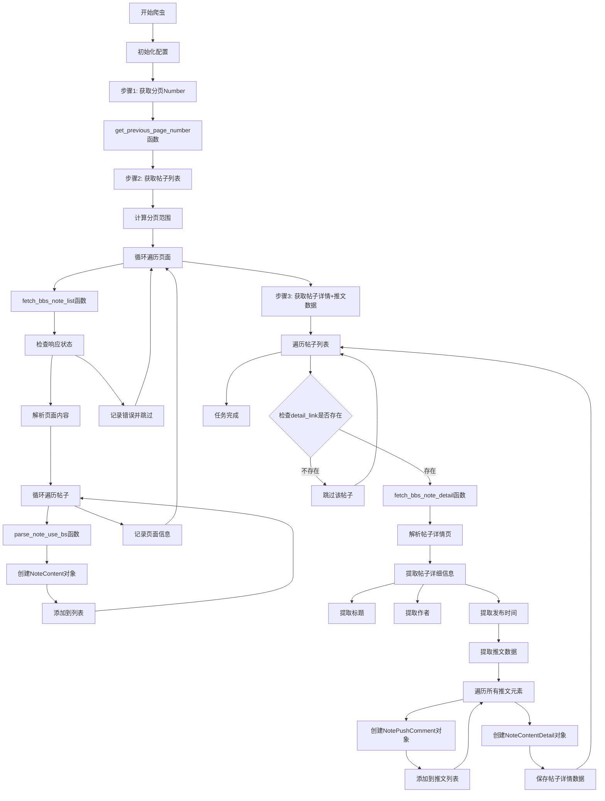

```mermaid
graph TD
    Start["开始爬虫"] --> Config["初始化配置"]
    Config --> Step1["步骤1: 获取分页Number"]
    Step1 --> GetPageNum["get_previous_page_number函数"]
    GetPageNum --> Step2["步骤2: 获取帖子列表"]
    Step2 --> CalcRange["计算分页范围"]
    CalcRange --> LoopPages["循环遍历页面"]
    LoopPages --> FetchPage["fetch_bbs_note_list函数"]
    FetchPage --> CheckStatus["检查响应状态"]
    CheckStatus --> Success["解析页面内容"]
    CheckStatus --> Error["记录错误并跳过"]
    Error --> LoopPages
    Success --> LoopNotes["循环遍历帖子"]
    LoopNotes --> ParseNote["parse_note_use_bs函数"]
    ParseNote --> CreateNote["创建NoteContent对象"]
    CreateNote --> AddList["添加到列表"]
    AddList --> LoopNotes
    LoopNotes --> CompletePage["记录页面信息"]
    CompletePage --> LoopPages
    LoopPages --> Step3["步骤3: 获取帖子详情+推文数据"]
    Step3 --> LoopDetail["遍历帖子列表"]
    LoopDetail --> CheckLink{"检查detail_link是否存在"}
    CheckLink --> |存在| FetchDetail["fetch_bbs_note_detail函数"]
    CheckLink --> |不存在| SkipNote["跳过该帖子"]
    SkipNote --> LoopDetail
    FetchDetail --> ParseDetail["解析帖子详情页"]
    ParseDetail --> ExtractDetail["提取帖子详细信息"]
    ExtractDetail --> ExtractTitle["提取标题"]
    ExtractDetail --> ExtractAuthor["提取作者"]
    ExtractDetail --> ExtractDate["提取发布时间"]
    ExtractDate --> ExtractPush["提取推文数据"]
    ExtractPush --> LoopPush["遍历所有推文元素"]
    LoopPush --> CreatePush["创建NotePushComment对象"]
    CreatePush --> AddPush["添加到推文列表"]
    AddPush --> LoopPush
    LoopPush --> CreateDetail["创建NoteContentDetail对象"]
    CreateDetail --> SaveDetail["保存帖子详情数据"]
    SaveDetail --> LoopDetail
    LoopDetail --> End["任务完成"]
```
