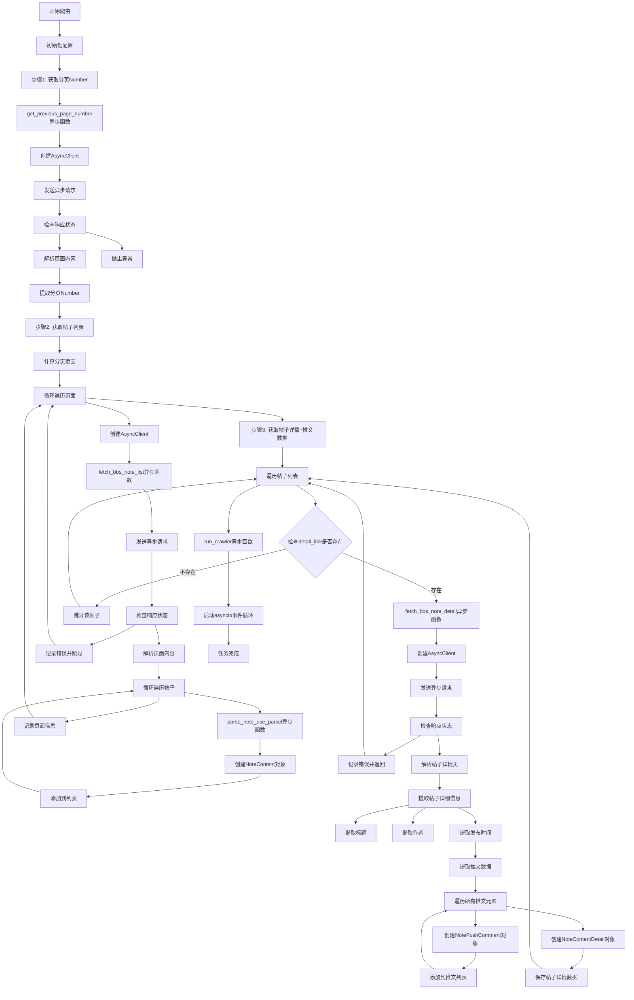

## 主要变化说明

1. **异步函数标记**：所有函数都标记为异步函数，使用`async def`定义
2. **异步HTTP客户端**：添加了`AsyncClient`的创建和管理流程
3. **异步请求**：所有HTTP请求都改为异步请求，使用`await client.get()`
4. **异步解析**：帖子解析函数从`parse_note_use_bs`改为`parse_note_use_parsel`
5. **事件循环**：添加了`asyncio.run(run_crawler())`来启动异步事件循环
6. **异步等待**：在调用异步函数时添加了`await`关键字
7. **错误处理**：异步版本的错误处理更加简洁，直接使用异常抛出

这些变化使得爬虫能够并发处理多个请求，提高了爬取效率，特别是在网络I/O密集型任务中表现更优。